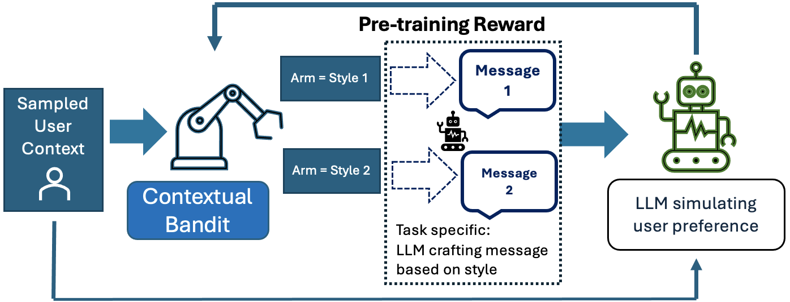
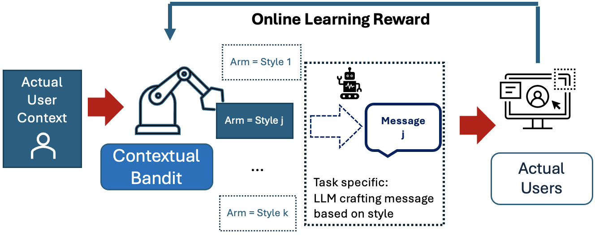

# Jump Starting Bandits with LLM-Generated Prior Knowledge

## Pretrain phase:

## Online fine-tuning phase:

### Instructions to run experiments.
#### First Experiment: Personalized Email Campaign for Charity Donations
##### To generate virtual users and responses:
python generate_dataset.py

#### To pretrain contextual bandit model and generate plots:
python pretrained-bandit.py -r 10

### Second Experiment: A Choice-Based Conjoint Analysis with Real-world Data

##### To generate virtual users and responses:
cd conjoint_simulation

python generate_counterfactuals.py 

##### To pretrain contextual bandit model and generate plots:
cd conjoint_simulation

python conjoint-pretrained-bandit.py -r 10

